# System Architecture Analysis

## Overview

- **Project**: /home/tom/github/tom-sapletta-com/glon
- **Analysis Mode**: static
- **Total Functions**: 41
- **Total Classes**: 2
- **Modules**: 4
- **Entry Points**: 29

## Architecture by Module

### glon.core
- **Functions**: 19
- **Classes**: 2
- **File**: `core.py`

### glon.cli
- **Functions**: 13
- **File**: `cli.py`

### glon.utils
- **Functions**: 9
- **File**: `utils.py`

## Key Entry Points

Main execution flows into the system:

### glon.cli.main
> Main CLI entry point.
- **Calls**: argparse.ArgumentParser, parser.add_argument, parser.add_argument, parser.add_argument, parser.add_argument, parser.parse_args, glon.cli.parse_git_url, glon.cli.create_directory_structure

### glon.utils.analyze_memory_usage
> Analyze current memory usage and provide statistics.

Returns:
    Dictionary with memory analysis
- **Calls**: psutil.Process, process.memory_info, gc.get_objects, ImportError, psutil.os.getpid, sorted, time.time, type

### glon.utils.monitor_memory_usage
> Monitor memory usage over time.

Args:
    duration: Monitoring duration in seconds
    interval: Sampling interval in seconds
    
Returns:
    List 
- **Calls**: psutil.Process, time.time, ImportError, psutil.os.getpid, process.memory_info, samples.append, time.sleep, time.time

### glon.core.MemoryProfiler.take_snapshot
> Take a memory snapshot.

Args:
    label: Optional label for the snapshot
    
Returns:
    Dictionary containing snapshot data
- **Calls**: self.snapshots.append, psutil.Process, process.memory_info, os.getpid, time.time, len, gc.get_count, gc.get_objects

### glon.utils.find_object_cycles
> Find reference cycles involving the given object.

Args:
    obj: Object to analyze
    max_depth: Maximum search depth
    
Returns:
    List of refe
- **Calls**: set, _find_cycles, id, visited.add, path.append, path.pop, visited.remove, gc.get_referents

### glon.utils.force_garbage_collection
> Force garbage collection on all generations.

Args:
    verbose: If True, print detailed information
    
Returns:
    Dictionary with collection resu
- **Calls**: range, len, gc.collect, len, gc.get_objects, gc.get_objects, print

### glon.utils.create_memory_logger
> Create a logger for memory-related events.

Args:
    log_file: Log file path
    
Returns:
    Configured logger instance
- **Calls**: logging.getLogger, logger.setLevel, logging.FileHandler, handler.setLevel, logging.Formatter, handler.setFormatter, logger.addHandler

### glon.core.GarbageCollector._record_stats
> Record current statistics for monitoring.
- **Calls**: self.stats_history.append, time.time, self.get_count, self.get_stats, len, self.get_objects

### glon.utils.cleanup_temp_files
> Clean up temporary files matching a pattern.

Args:
    pattern: File pattern to match (default: "*")
    
Returns:
    Number of files cleaned up
- **Calls**: tempfile.gettempdir, os.listdir, os.path.join, os.path.isfile, os.remove

### glon.core.GarbageCollector.get_memory_summary
> Get a summary of memory usage and garbage collection status.
- **Calls**: self.get_count, self.get_stats, len, gc.get_threshold, self.get_objects

### glon.core.MemoryProfiler.track_object
> Track an object using weak reference.

Args:
    obj: Object to track
    label: Optional label for the object
    
Returns:
    Tracking ID
- **Calls**: str, id, weakref.ref, time.time, type

### glon.core.MemoryProfiler.compare_snapshots
> Compare two memory snapshots.

Args:
    index1: Index of first snapshot
    index2: Index of second snapshot
    
Returns:
    Comparison data
- **Calls**: IndexError, snap1.get, snap2.get, len, len

### glon.core.MemoryProfiler.get_tracked_objects
> Get information about tracked objects.
- **Calls**: self.weak_refs.items, info.get, info.get

### glon.core.GarbageCollector.collect
> Force garbage collection for a specific generation.

Args:
    generation: Generation number (0, 1, or 2)
    
Returns:
    Number of objects collecte
- **Calls**: gc.collect, self._record_stats

### glon.utils.get_object_size
> Get approximate size of an object in bytes.

Args:
    obj: Object to measure
    
Returns:
    Approximate size in bytes
- **Calls**: sys.getsizeof

### glon.utils.set_debug_gc
> Set garbage collection debug flags.

Args:
    flags: Debug flags (gc.DEBUG_STATS, gc.DEBUG_LEAK, etc.)
- **Calls**: gc.set_debug

### glon.utils.clear_gc_debug
> Clear garbage collection debug flags.
- **Calls**: gc.set_debug

### glon.core.GarbageCollector.__init__
- **Calls**: gc.isenabled

### glon.core.GarbageCollector.enable
> Enable garbage collection.
- **Calls**: gc.enable

### glon.core.GarbageCollector.disable
> Disable garbage collection.
- **Calls**: gc.disable

### glon.core.GarbageCollector.get_stats
> Get current garbage collection statistics.
- **Calls**: gc.get_stats

### glon.core.GarbageCollector.get_count
> Get current garbage collection counts.
- **Calls**: gc.get_count

### glon.core.GarbageCollector.set_threshold
> Set garbage collection threshold.
- **Calls**: gc.set_threshold

### glon.core.GarbageCollector.get_objects
> Get all objects currently tracked by the garbage collector.
- **Calls**: gc.get_objects

### glon.core.GarbageCollector.get_referrers
> Get all objects that refer to the given object.
- **Calls**: gc.get_referrers

### glon.core.GarbageCollector.get_referents
> Get all objects referred to by the given object.
- **Calls**: gc.get_referents

### glon.core.MemoryProfiler.clear_snapshots
> Clear all stored snapshots.
- **Calls**: self.snapshots.clear

### glon.core.MemoryProfiler.clear_tracking
> Clear all tracked objects.
- **Calls**: self.weak_refs.clear

### glon.core.MemoryProfiler.__init__

## Process Flows

Key execution flows identified:

### Flow 1: main
```
main [glon.cli]
```

### Flow 2: analyze_memory_usage
```
analyze_memory_usage [glon.utils]
```

### Flow 3: monitor_memory_usage
```
monitor_memory_usage [glon.utils]
```

### Flow 4: take_snapshot
```
take_snapshot [glon.core.MemoryProfiler]
```

### Flow 5: find_object_cycles
```
find_object_cycles [glon.utils]
```

### Flow 6: force_garbage_collection
```
force_garbage_collection [glon.utils]
```

### Flow 7: create_memory_logger
```
create_memory_logger [glon.utils]
```

### Flow 8: _record_stats
```
_record_stats [glon.core.GarbageCollector]
```

### Flow 9: cleanup_temp_files
```
cleanup_temp_files [glon.utils]
```

### Flow 10: get_memory_summary
```
get_memory_summary [glon.core.GarbageCollector]
```

## Key Classes

### glon.core.GarbageCollector
> Enhanced garbage collector with monitoring and control features.
- **Methods**: 12
- **Key Methods**: glon.core.GarbageCollector.__init__, glon.core.GarbageCollector.enable, glon.core.GarbageCollector.disable, glon.core.GarbageCollector.collect, glon.core.GarbageCollector.get_stats, glon.core.GarbageCollector.get_count, glon.core.GarbageCollector.set_threshold, glon.core.GarbageCollector.get_objects, glon.core.GarbageCollector.get_referrers, glon.core.GarbageCollector.get_referents

### glon.core.MemoryProfiler
> Memory profiling and monitoring utilities.
- **Methods**: 7
- **Key Methods**: glon.core.MemoryProfiler.__init__, glon.core.MemoryProfiler.take_snapshot, glon.core.MemoryProfiler.track_object, glon.core.MemoryProfiler.get_tracked_objects, glon.core.MemoryProfiler.compare_snapshots, glon.core.MemoryProfiler.clear_snapshots, glon.core.MemoryProfiler.clear_tracking

## Data Transformation Functions

Key functions that process and transform data:

### glon.cli.parse_git_url
> Parse git URL and extract owner and repository name.

Args:
    url: Git URL (SSH or HTTPS)
    
Ret
- **Output to**: re.match, re.match, re.match, ssh_match.group, ssh_match.group

### glon.cli.parse_time_filter
> Parse time filter string like 'last month', 'last week', 'today'.

Args:
    filter_str: Time filter
- **Output to**: None.strip, datetime.now, filter_str.lower, timedelta, timedelta

## Public API Surface

Functions exposed as public API (no underscore prefix):

- `glon.cli.main` - 113 calls
- `glon.cli.grab_from_clipboard` - 37 calls
- `glon.cli.list_projects` - 33 calls
- `glon.cli.open_in_ide` - 30 calls
- `glon.utils.analyze_memory_usage` - 16 calls
- `glon.utils.monitor_memory_usage` - 13 calls
- `glon.core.MemoryProfiler.take_snapshot` - 12 calls
- `glon.utils.find_object_cycles` - 11 calls
- `glon.cli.get_all_projects_with_time` - 11 calls
- `glon.cli.parse_git_url` - 9 calls
- `glon.cli.clone_repository` - 9 calls
- `glon.cli.parse_time_filter` - 9 calls
- `glon.utils.force_garbage_collection` - 7 calls
- `glon.utils.create_memory_logger` - 7 calls
- `glon.utils.cleanup_temp_files` - 5 calls
- `glon.core.GarbageCollector.get_memory_summary` - 5 calls
- `glon.core.MemoryProfiler.track_object` - 5 calls
- `glon.core.MemoryProfiler.compare_snapshots` - 5 calls
- `glon.core.MemoryProfiler.get_tracked_objects` - 3 calls
- `glon.cli.create_directory_structure` - 3 calls
- `glon.core.GarbageCollector.collect` - 2 calls
- `glon.cli.get_all_projects` - 2 calls
- `glon.utils.get_object_size` - 1 calls
- `glon.utils.set_debug_gc` - 1 calls
- `glon.utils.clear_gc_debug` - 1 calls
- `glon.core.GarbageCollector.enable` - 1 calls
- `glon.core.GarbageCollector.disable` - 1 calls
- `glon.core.GarbageCollector.get_stats` - 1 calls
- `glon.core.GarbageCollector.get_count` - 1 calls
- `glon.core.GarbageCollector.set_threshold` - 1 calls
- `glon.core.GarbageCollector.get_objects` - 1 calls
- `glon.core.GarbageCollector.get_referrers` - 1 calls
- `glon.core.GarbageCollector.get_referents` - 1 calls
- `glon.core.MemoryProfiler.clear_snapshots` - 1 calls
- `glon.core.MemoryProfiler.clear_tracking` - 1 calls

## System Interactions

How components interact:

```mermaid
graph TD
    main --> ArgumentParser
    main --> add_argument
    analyze_memory_usage --> Process
    analyze_memory_usage --> memory_info
    analyze_memory_usage --> get_objects
    analyze_memory_usage --> ImportError
    analyze_memory_usage --> getpid
    monitor_memory_usage --> Process
    monitor_memory_usage --> time
    monitor_memory_usage --> ImportError
    monitor_memory_usage --> getpid
    monitor_memory_usage --> memory_info
    take_snapshot --> append
    take_snapshot --> Process
    take_snapshot --> memory_info
    take_snapshot --> getpid
    take_snapshot --> time
    find_object_cycles --> set
    find_object_cycles --> _find_cycles
    find_object_cycles --> id
    find_object_cycles --> add
    find_object_cycles --> append
    force_garbage_collec --> range
    force_garbage_collec --> len
    force_garbage_collec --> collect
    force_garbage_collec --> get_objects
    create_memory_logger --> getLogger
    create_memory_logger --> setLevel
    create_memory_logger --> FileHandler
    create_memory_logger --> Formatter
```



## Reverse Engineering Guidelines

1. **Entry Points**: Start analysis from the entry points listed above
2. **Core Logic**: Focus on classes with many methods
3. **Data Flow**: Follow data transformation functions
4. **Process Flows**: Use the flow diagrams for execution paths
5. **API Surface**: Public API functions reveal the interface

## Context for LLM

Maintain the identified architectural patterns and public API surface when suggesting changes.